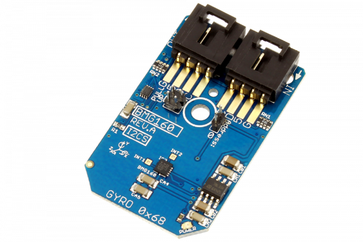

[](https://store.ncd.io/product/bmg160-16-bit-triaxial-%C2%B1125s-to-%C2%B12000s-gyroscope-sensor-i2c-mini-module/).

# BMG160

The Bosch Sensortec’s BMG160 is a digital 3-axis angular rate sensor which ranges up to 2000°/s and a digital resolution of 16-bit for consumer electronics applications.It is capable to measure angular rates and three perpendicular room demensions, the x-, y- and z-axis, and to provide the corresponding output signals.The BMG160 also allows low-noise measurement.This Device is available from www.ncd.io

[SKU: BMG160]

(https://store.ncd.io/product/bmg160-16-bit-triaxial-%C2%B1125s-to-%C2%B12000s-gyroscope-sensor-i2c-mini-module/)
This Sample code can be used with Raspberry Pi.

Hardware needed to interface BMG160 3Axis gyroscope With Raspberry Pi :

1. <a href="https://store.ncd.io/product/bmg160-16-bit-triaxial-%C2%B1125s-to-%C2%B12000s-gyroscope-sensor-i2c-mini-module/">BMG160 3Axis Gyroscope Sensor</a>

2. <a href="https://store.ncd.io/product/i2c-shield-for-raspberry-pi-3-pi2-with-outward-facing-i2c-port-terminates-over-hdmi-port/">Raspberry Pi I2C Shield</a>

3. <a href="https://store.ncd.io/product/i%C2%B2c-cable/">I2C Cable</a>

## Python

Download and install smbus library on Raspberry pi. Steps to install smbus are provided at:

https://pypi.python.org/pypi/smbus-cffi/0.5.1

Download (or git pull) the code in pi. Run the program.

```cpp
$> python BMG160.py
```
The lib is a sample library, you will need to calibrate the sensor according to your application requirement.
